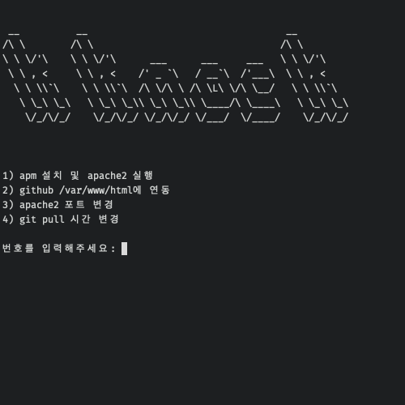
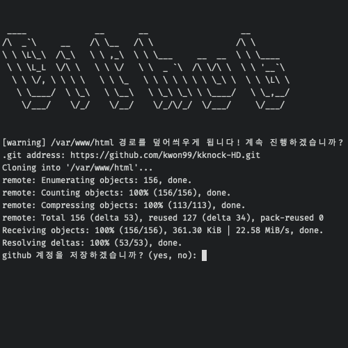
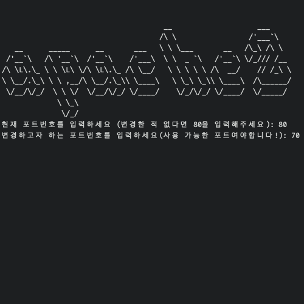
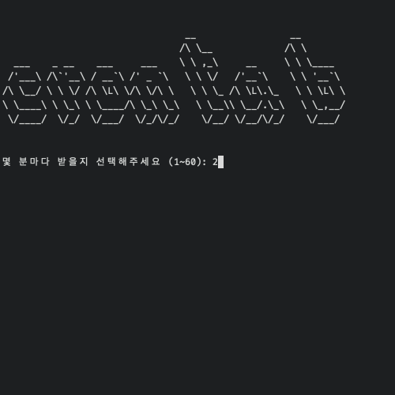
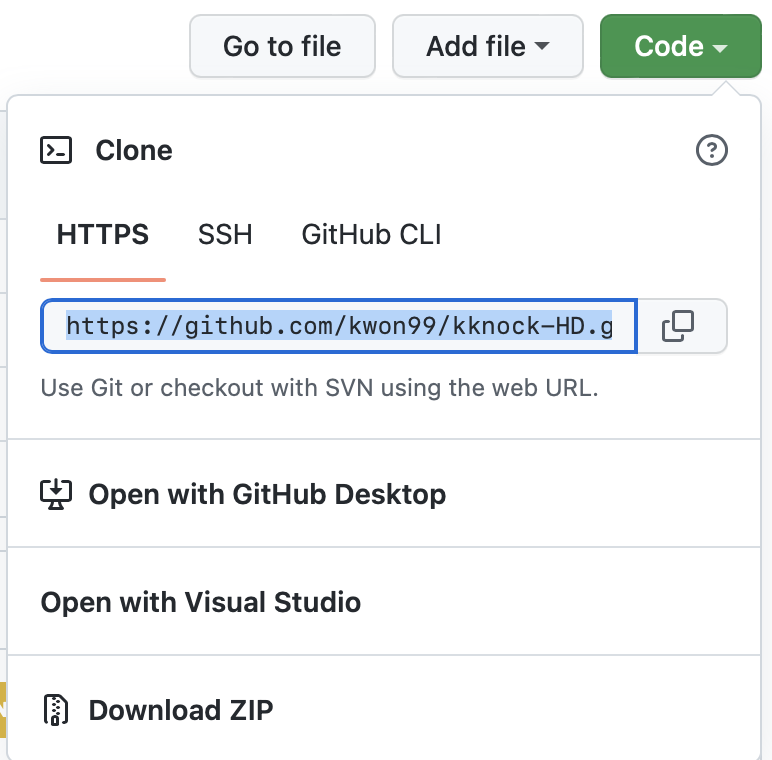

<div id="top"></div>

[![Contributors][contributors-shield]][contributors-url]
[![Forks][forks-shield]][forks-url]
[![Stargazers][stars-shield]][stars-url]
[![Issues][issues-shield]][issues-url]

<!-- PROJECT LOGO -->
<br />
<div align="center">
  <a href="https://github.com/kwon99/kknock-HD">
    
  </a>

  <h3 align="center">kknock-HD</h3>

  <p align="center">
  서버 설정 및 여러 편의기능들을 제공하는 쉘 파일 기반 프로그램
  <br />
  </p>
</div>

## 미리보기

|            메인             |          github 연동          |       apache2 포트 변경        |        자동화 시간 변경        |
| :-------------------------: | :---------------------------: | :----------------------------: | :----------------------------: |
|  |  |  |  |

## 사용 방법

### 프로그램 설치

```shell
git clone https://github.com/kwon99/kknock-HD
```

### 프로그램 실행

```shell
sudo su
```

```shell
sudo chmod +x setup.sh
```

```shell
sudo ./setup.sh
```

### github 연동

<div align="center">
  <h4 align="center">github는 비밀번호를 통한 저장소 로그인을 더 이상 지원하지 않습니다.</h4>
  <p align="center">따라서 <a href="https://velog.io/@nara7875/github-토큰-발급하기">github token</a>을 발급받아 비밀번호 대신 사용해야 합니다!!<p>
  <br>
  
  <p align="center">.git address는 다음 사진과 같이 입력하시면 됩니다.</p>
</div>

<!-- MARKDOWN LINKS & IMAGES -->
<!-- https://www.markdownguide.org/basic-syntax/#reference-style-links -->

[contributors-shield]: https://img.shields.io/github/contributors/kwon99/kknock-HD.svg?style=for-the-badge
[contributors-url]: https://github.com/kwon99/kknock-HD/graphs/contributors
[forks-shield]: https://img.shields.io/github/forks/kwon99/kknock-HD.svg?style=for-the-badge
[forks-url]: https://github.com/kwon99/kknock-HD/network/members
[stars-shield]: https://img.shields.io/github/stars/kwon99/kknock-HD.svg?style=for-the-badge
[stars-url]: https://github.com/kwon99/kknock-HD/stargazers
[issues-shield]: https://img.shields.io/github/issues/kwon99/kknock-HD.svg?style=for-the-badge
[issues-url]: https://github.com/kwon99/kknock-HD/issues
[license-shield]: https://img.shields.io/github/license/kwon99/kknock-HD.svg?style=for-the-badge
[license-url]: https://github.com/kwon99/kknock-HD/blob/master/LICENSE.txt
